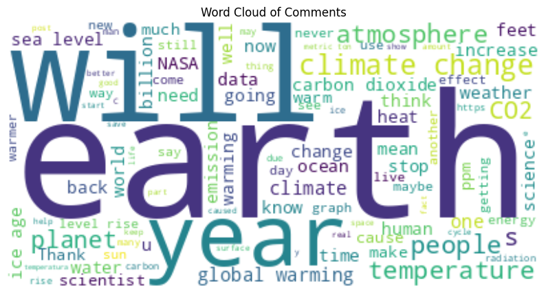

# 🌍 Climate NASA Comments Analysis & Engagement Prediction

---

## 📌 Project Overview  
This project analyzes public comments on NASA's climate change posts, focusing on:  
- **Sentiment classification:** Predict whether a comment is negative, neutral, or positive.  
- **Engagement regression:** Predict how many likes a comment will receive, using comment characteristics and sentiment.  

Machine learning models applied include Random Forest Classifier and Regressor.

---

## 🔍 Dataset Summary  
- **Rows:** 522 user comments  
- **Columns:**  5
  - `likesCount`: 522 
  - `commentsCount`: 244
  - `text`: 504
  - `date`: 2020-09-15 21:25:05+00:00 to 2023-12-25 13:34:39+00:00
  - `profileName`: 522  

### Features engineered  
- `comment_length` (173)  
- `word_count` (32)  
- `sentiment_score` (0.7804)  
- `sentiment_category` (negative, neutral, positive)  
- `year`, `month`, `day_of_week`, `hour` (from `date`)  

---

## 📈 Key Data Insights  
✅ Most comments received few likes (right-skewed).  
✅ Comments are generally short (under 100 words).  
✅ Sentiment is mostly neutral or positive.  
✅ Engagement trends show peaks at certain times.

---

## ⚙ Modeling  

### 1️⃣ Sentiment Classification  
- **Model:** Random Forest Classifier  
- **Features:** Engagement, time, text stats  
- **Target:** Sentiment category (-1 = negative, 0 = neutral, 1 = positive)

| Metric | Value |
|---------|-------|
| Accuracy | 1.00 |
| Weighted F1 Score | 1.00 |

---

### 2️⃣ Engagement Regression  
- **Model:** Random Forest Regressor  
- **Target:** log(likesCount)

| Metric | Value |
|---------|-------|
| MAE (log_likes) | 0.7352 |
| RMSE (log_likes) | 0.9466
| R² | 0.2168 |

---

## 🚀 Conclusions  
✅ Predicting sentiment and engagement is feasible using Random Forests.  
✅ Sentiment, comment length, and timing contribute to engagement.  

---

